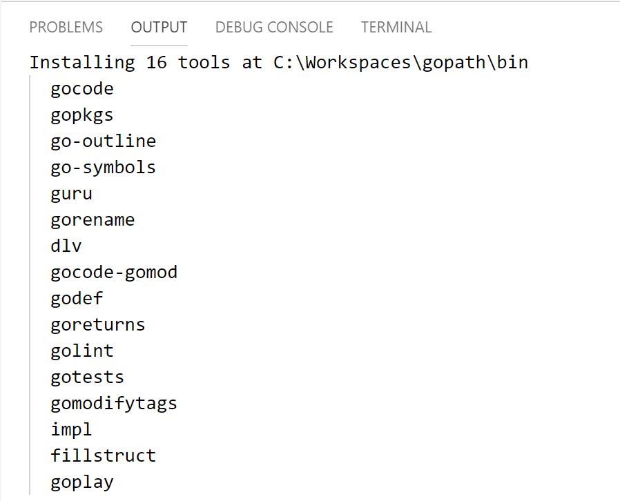

# Contribute to Terraform AzureRM provider

This document describe how you can get ready to contribute to the [AzureRM Terraform provider](https://github.com/terraform-providers/terraform-provider-azurerm).

## Setup your system

### Terraform

You need to install Terraform on your dev environment. You can downlaod it from [this page](https://www.terraform.io/downloads.html).

### Go tools

Terraform is developed using Go. You need to install Go **1.11.x** to be able to build and debug the provider locally.
You can download it from [this page](https://golang.org/dl/) and find the installation instructions for your system [here](https://golang.org/doc/install#install)

Then you can test your environment following the instructions on [this page](https://golang.org/doc/install#testing).

### Check you GOPATH

As of many Go project, AzureRM Terraform provider rely on your GOPATH environment variable. You may want to make sure it is well configured for your system, reading [this page](https://github.com/golang/go/wiki/SettingGOPATH).

### Visual Studio Code

You can use the IDE you love, but in this documentation we will describe how to contribute to the Terraform AzureRM provider using Visual Studio Code. You can download it for your system from [this page](https://code.visualstudio.com/Download).

Once installed, download the Go extension for VS Code:


Once installed, open VS Code and look for the `Go: Install/Update Tools` in the command palette, a select all the tools:




### Specific requirements for Windows users

If you are running Windows, then you need to install Git Bash and Make for Windows. Check the dedicated section on Terraform on Azure repository [here](https://github.com/terraform-providers/terraform-provider-azurerm#windows-specific-requirements).

## Get the sources

First, go to the [AzureRM Terraform provider](https://github.com/terraform-providers/terraform-provider-azurerm) project page and fork the repository into your GitHub account.

Once done, you need to clone your fork into the `$GOPATH/src/github.com/terraform-providers/terraform-provider-azurerm` folder.

## Build the sources

You can check that everything is OK by building the AzureRM provider:

```bash
cd $GOPATH/src/github.com/terraform-providers/terraform-provider-azurerm
make build
```

Once completed, the binary of the AzureRM provider should be available in the `$GOPATH/bin` directory.

*Note: on Windows, you need to use Git Bash*

More information [here](https://github.com/terraform-providers/terraform-provider-azurerm#developing-the-provider).

## Work with your local build

Once you have built a new version of the AzureRM Terraform provider, you can use it locally.
To use your local version, the first thing to do is a `terraform init`, as usual, to inialize your terraform working directory.

The init operation will download the AzureRM Provider for you. You can just remove it, and replace it with your local copy.

Do a `terraform init` again and you're done ! :-) 

## Debug the AzureRM provider using Visual Studio Code and Delve

It is possible to use Visual Studio Code and Delve (the Golang debugger) to debug the AzureRM provider.

**TODO**

## Other

### Slack

You can request an invite to access the Terraform on Azure Slack [here](https://join.slack.com/t/terraform-azure/shared_invite/enQtNDMzNjQ5NzcxMDc3LTJkZTJhNTg3NTE5ZTdjZjFhMThmMTVmOTg5YWJkMDU1YTMzN2YyOWJmZGM3MGI4OTQ0ODQxNTEyNjdjMDAxMjM).